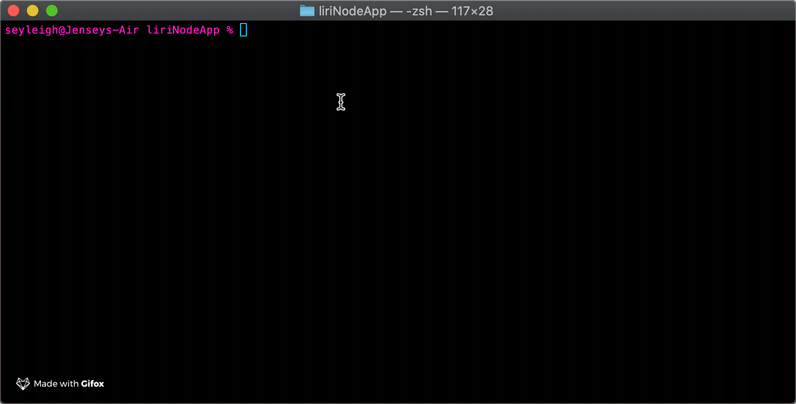

# Liri Node App

This a command line app that acts like Siri but uses user input in place of voice command. 

---

### Technologies used:

* fs
* axios
* moment.js
* Spotify API
* Bands in Town API
* OMDB API
* Gitfox

---

[Link to GitHub repo](https://github.com/seyleigh/liriNodeApp)

---

```javascript

node liri.js concert-this + artist

```
This command will make a request from the BiT API and give back concerts for that artist with the following items:
- Venue
- City
- Date


---

```javascript

node liri.js spotify-this-song

node liri.js spotify-this-song + song name

```

The first command will return the default song that has been set. 

The second command will return a song with those words in it, I found out that it doesn't return exactly the song I have in mind. I haven't found a way to solve that without breaking the 'do what it says' command yet, but I want to keep looking into that.



---

```javascript

node liri.js movie-this

node liri.js movie-this + movie name

```
The first command will return the default movie that has been set.

The second command will return the OMDB data for the given movie the user inputs. The data inclues:
- Title
- Year
- IMDB Rating
- Rotten Tomatoes Rating
- Country
- Language
- Plot
- Actors


