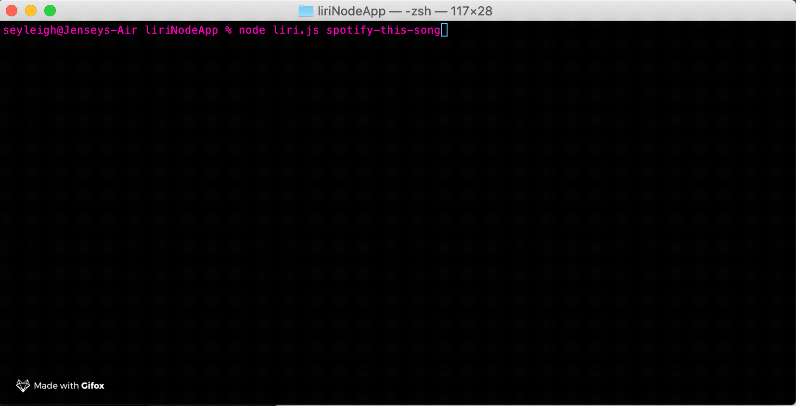
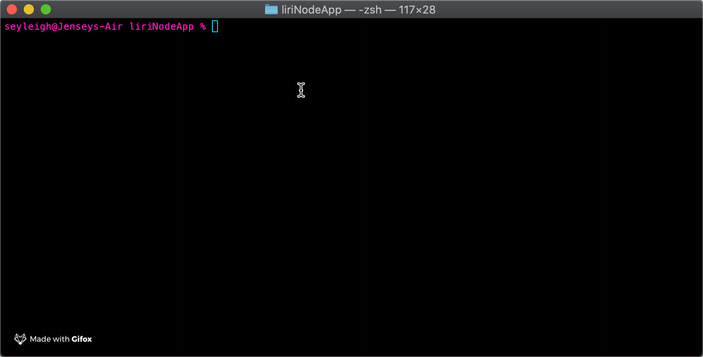
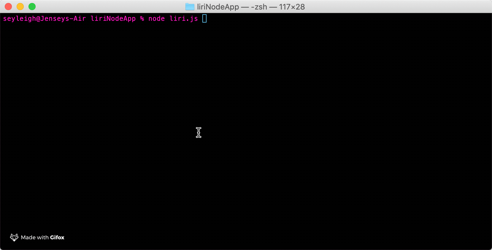
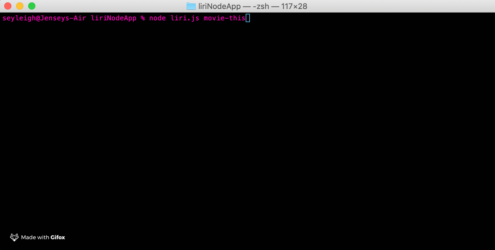
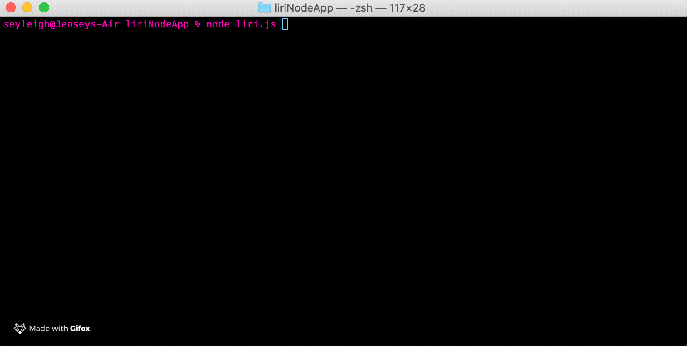
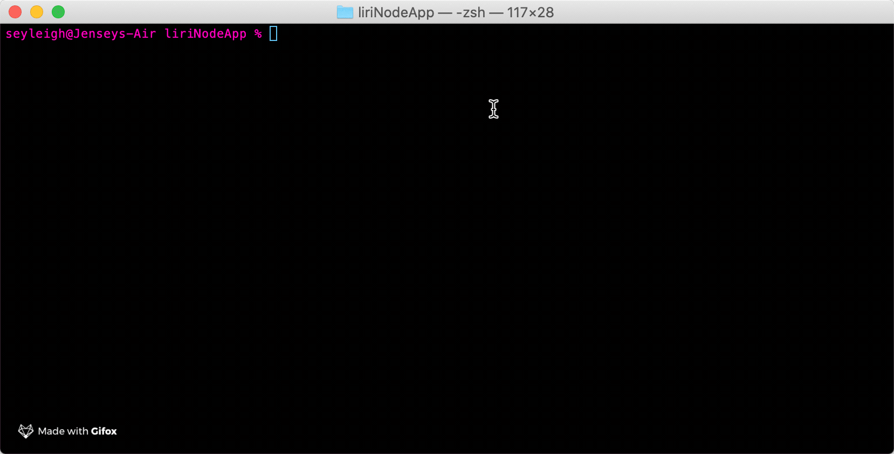

# Liri Node App

This a command line app that acts like Siri but uses user input in place of voice command. 

---

### Technologies used:

* fs
* axios
* moment.js
* Spotify API
* Bands in Town API
* OMDB API
* Gitfox

---

[Link to GitHub repo](https://github.com/seyleigh/liriNodeApp)

---

```javascript

node liri.js concert-this + artist

```
This command will make a request from the BiT API and give back concerts for that artist with the following items:
- Venue
- City
- Date


---

```javascript

node liri.js spotify-this-song

node liri.js spotify-this-song + song name

```

The first command will return the default song that has been set. 

The second command will return a song with those words in it, I found out that it doesn't return exactly the song I have in mind. 



---

```javascript

node liri.js movie-this

node liri.js movie-this + movie name

```
The first command will return the default movie that has been set.

The second command will return the OMDB data for the given movie the user inputs. The data inclues:
- Title
- Year
- IMDB Rating
- Rotten Tomatoes Rating
- Country
- Language
- Plot
- Actors



---

``` javascript

node liri.js do-what-it-says

```
This command will read the random.txt file and 'do what it says'. Meaning, it will run whichever funtion is put into it along with the term parameters. You can change the 'spotify-this-song' to either of the other two functions with whatever movie or artist of your choice and it will run it like the concertThis and movieThis functions.


---

Lastly - if you run
```javascript
node liri.js
```
with no other parameters it will return a console log stating:
 

## Issues

I wasn't able to figure out a way to make spotify return the songs I actually wanted without breaking my do-what-it-says function. I tried many solutions and nothing seemed to work.

I didn't have time to get to the bonus with the ```javascript fs.appendFile ``` to log all my user inputs. I would like to go back and make that work in the future.

I learned that you can make terminal code look all pretty and coloured too, which I never knew was possible and I would like to figure that out in the future at some point as well.


